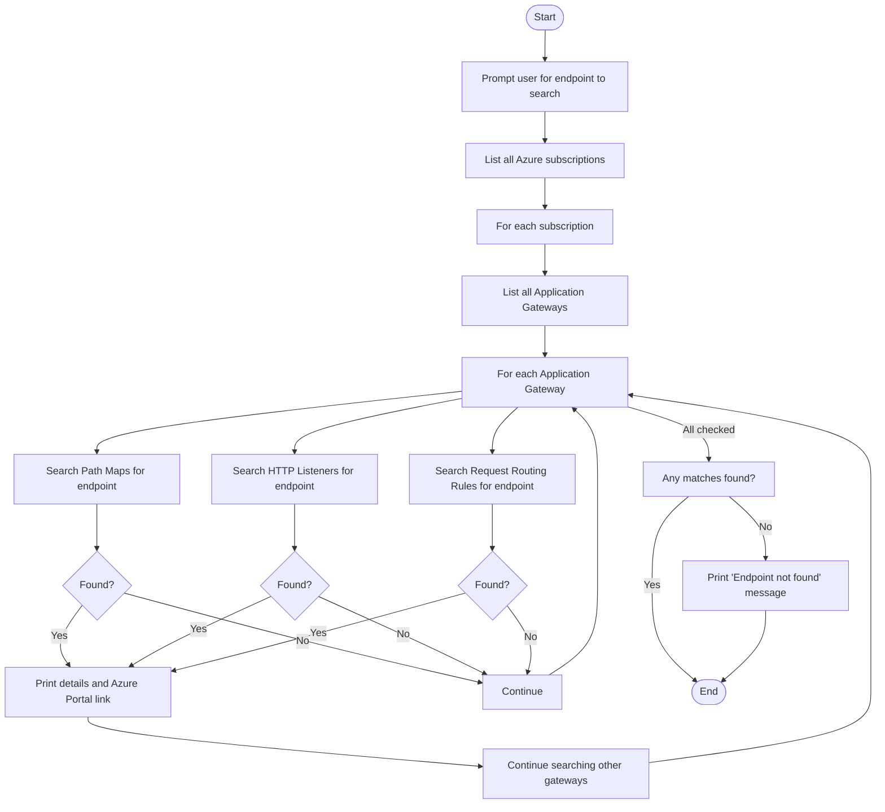

# endpointsearch


**endpointsearch** is a Python tool to search for a specific endpoint (path or hostname) across all Azure Application Gateways in all subscriptions of your tenant. It is designed for cloud administrators and support teams to quickly locate where a domain or path is configured, helping to resolve incidents and manage infrastructure efficiently.

---

## Features

- Uses Azure CLI credentials for authentication (no secrets in code)
- Iterates all subscriptions in the tenant
- Searches for the endpoint in:
	- Path Maps (URL path rules)
	- HTTP Listeners (hostnames and listener names)
	- Request Routing Rules (including redirects)
- Prints detailed information about where the endpoint is found, including direct Azure Portal links
- Informs you if the endpoint is not found anywhere

---

## Requirements

- Python **3.8+**
- Azure CLI installed and authenticated (`az login`)
- Permissions to list Application Gateways in your subscriptions
- Install dependencies:
	- `azure-identity`
	- `azure-mgmt-network`
	- `azure-mgmt-resource`


Install all dependencies with (**note the -r flag!**):

```bash
pip install -r requirements.txt
```

> **Note:** The `-r` flag is required. Do **not** run `pip install requirements.txt` (without `-r`), as that will not work.

---

## Installation

```bash
git clone https://github.com/JavierRamirezMoral/endpointsearch.git
cd endpointsearch
python -m venv .venv
source .venv/bin/activate  # On Windows: .venv\Scripts\activate
pip install -r requirements.txt
```

---

## Usage

Run the script interactively:

```bash
python endpointSearch.py
```

You will be prompted to enter the endpoint to search (e.g., `/myapi` or `api.mydomain.com`).

#### Example Output

```
🔎 Enter the endpoint to search (e.g., /myapi or api.mydomain.com): api.mydomain.com

🔍 Searching for endpoint 'api.mydomain.com' in all Application Gateways of the tenant...

📦 Checking subscription: xxxxxxxx (xxxxxxxxxxxxxxxxxxx)
📦 Checking subscription: xxxxxxxx (xxxxxxxxxxxxxxxxxxx)
📦 Checking subscription: xxxxxxxxxxxxxxxxxxx (xxxxxxxxxxxxxxxxxxx)
✅ Possible match in Listener of App GW: appgw-example-dpt
   - Subscription: xxxxxxxxxxxxxxxxxxx
   - Resource Group: xxxxxxxxxxxxxxxxxxx
   - Listener Name: xxxxxxxxxxxxxxxxxxx
   - Hostname: api.mydomain.com
   - 🔗 Azure Portal: https://portal.azure.com/#@/resource/subscriptions/xxxxxxxxxxxxxxxxxxx/resourceGroups/xxxxxxxxxxxxxxxxxxx/providers/Microsoft.Network/applicationGateways/appgw-example-dpt
```

If the endpoint is not found, you will see:

```
🔎 Enter the endpoint to search (e.g., /myapi or api.mydomain.com): example.notfound.com

🔍 Searching for endpoint 'example.notfound.com' in all Application Gateways of the tenant...

📦 Checking subscription: xxxxxxxx (xxxxxxxxxxxxxxxxxxx)
📦 Checking subscription: xxxxxxxxxxxxxxxxxxx (xxxxxxxxxxxxxxxxxxx)
📦 Checking subscription: xxxxxxxx (xxxxxxxxxxxxxxxxxxx)
❌ Endpoint not found in any Application Gateway of the tenant.
```

---


---

## Workflow


Below is a high-level workflow of how **endpointsearch** works to locate an endpoint across all Azure Application Gateways in your tenant:



This flowchart illustrates how the script prompts for an endpoint, iterates all subscriptions and Application Gateways, searches for the endpoint in Path Maps, Listeners, and Rules, prints results if found, and notifies if not found anywhere.

---

## Example: Use as a Module

You can import and use the main function in your own Python code. See [`examples/usage_example.py`](examples/usage_example.py):

```python
from endpointSearch import get_app_gateways_with_endpoint_all_subs

get_app_gateways_with_endpoint_all_subs("/myapi")
```

---

## Testing

This project includes tests using `pytest`. To run the tests:

```bash
pytest
```

---

## CI/CD

This repository includes a GitHub Actions workflow that:
- Installs Python 3.10
- Installs dependencies from requirements.txt
- Runs pytest to validate the code
Every push or pull request will automatically trigger the tests.

---

## Contributing

Contributions are welcome! Please open an issue to suggest improvements or report bugs, or submit a pull request with your changes.

---

## License

This project is licensed under the MIT License. See the [LICENSE](LICENSE) file for details.
